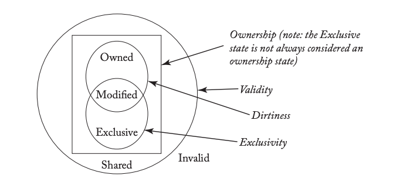

## Overview

Coherence makes cache invisible, while consistency makes shared memory virtually a
single module.

Processor cores are given 2 methods through coherence interface: 1) a *read-request* that
takes a memory location and returns a value; and 2) a *write-request* that takes a memory
location & a value and returns an acknowledgement.

Coherence invariants: single-writer-multiple-reader (SWMR) and data-value.

A memory consistency model (MC) defines permissable behaviors of multithreaded programs
with shared memory. It requires more than cache coherency and is also affected by the
reordering in the pipeline.

## Sequential Consistency (SC)

SC requires 1) that all cores insert their loads and stores into the global memory order
respecting their program order and 2) that every load gets its value from the last store
before it to the same address.

2 operations conflict if they are to the same address and at least one of them is a store.

SC dictates the order in which loads and stores get applied to coherent memory, but not the
order of coherence activity.

Synchronization requires atomic operations. It involves instructions that perform a "read-modify-write"
(RMW).

SC can be compared with database serializability.

## Total Store Order (TSO)

A store enters the write buffer when it commits and exits when the block is in the cache in
a read-write coherence state. TSO makes write buffer architecturally invisible while SC cannot.
It does so by omitting the Store -> Load constraint, which allows each core to use a write buffer.
Note that Store -> Store constraint requires the write buffer to be FIFO.

The value of a load is the value of the last store to the same address that is either a) before
it in memory order or b) before it in program order. Scenario b) take precedence, implying that
write buffer bypassing overrides the rest of the memory system.

FENCEs enforce program order onto memory order. If the programmer wants a store and a subsequent
load to be ordered, he must put a FENCE in between. Under TSO, a simple implementation of FENCE
may be draining the write buffer when executed and not permitting subsequent loads to execute
until it has committed.

The store queue holds uncommitted stores and the write buffer holds committed stores.

TSO write buffers are logically private to each thread context. Therefore, in multithreading,
one thread context shall never bypass from the write buffer of another thread context. This
is important for SMT/hyperthreading.

The atomic RMW effectively drains the write buffer before its load can be performed. Furthermore,
the load requires read-write coherence permissions. Lastly, to guarantee atomicity, the cache
controller may not relinquish coherence permission to the block between the load and the store.

## Relaxed Memory Consistency

Relaxed memory consistency models only preserve the orders that programmers *require*. Since
proper operation does not depend on any ordering of the loads and stores unless to the same
address, higher performance can be attained by exploiting opportunities such as a non-FIFO
coalescing write buffer, simpler support for core speculation, and coupling consistency and coherence.

XC maintains TSO rules for ordering 2 accesses to the *same* address.

To implement RMW in XC, draining the write buffer is not necessary because XC allows both the
load part and store part to bypass earlier stores. Thus, it is sufficient to first acquire
read-write coherence permissions and then perform the load and store without relinquishing
the block in between.

## Coherence Protocols

To implement the invariants, a finite state machine called *cache controller* is attached to each cache.
On the *core side*, the controller accepts loads and stores. A cache miss causes the controller to
initiate a coherence transaction by issuing a coherence request. On its *network side*, it receives
coherence requests and responses.

We refer to the controller at the LLC/memory as *memory controller*. It is similar to a cache
controller except that it only has the network side. As such, it does not issue coherence requests or
receive coherence responses.

A writeback cache, when a store hits, only writes to the local cache and waits to write the entire block
back to the LLC/memory at eviction.

The choices of stable states and transactions are largely independent of the rest of the protocol.
However, the events, transitions, and transient states are highly dependent.

4 characteristics of a block can be used to distinguish between valid states: *validity*, *dirtiness*,
*exclusivity*, and *ownership*. The latter 2 are unique to systems with multiple actors. *Stable states*
describe blocks not currently in the midst of a coherence transaction while *transient states* are used
otherwise.

MOESI states cover what most coherence protocols need, while MSI states are the most fundamental.
All states besides I are valid. Both M and E denote exclusivity. Both M and O suggest that the block
can be dirty.

- M(odified): valid, exclusive, owned, and potentially dirty. This cache has the only valid copy
of the block and must respond to requests for the block. The copy at the LLC/memory may be stale.

- S(hared): valid, not exclusive, not dirty, and not owned. This cache has a read-only copy of
the block, and other cache may also have valid read-only copies.

- I(nvalid): This cache either has not the block or contains a stale copy.

- O(wned): valid, owned, potentially dirty, but not exclusive. This cache has a read-only copy
of the block and must respond to requests for it. Other caches may have a read-only copy, but
they are not owners. The copy at the LLC/memory may be stale.

- E(xclusive): valid, exclusive, and clean. This cache has a read-only copy of the block.
No other cache has a valid copy of it, and the copy in the LLC/memory is up-to-date. There are
protocols in which E state is not treated as an ownership state.

There are 2 general approaches to naming blocks in LLC/memory. In the more common *cache-centric* approach,
the state of the block is an aggregate of the states of the block in private caches. In the
*memory-centric* approach, the state corresponds to the *memory controller*'s permissions to the block.

For caches and LLC, maintaining the stable states requires adding a few bits to the per-block state.
To maintain transient states for blocks awaiting coherence transactions, implementations usually
add bits to the MSHRs or similar structures that track pending transactions. With an inclusive LLC,
memory does not need to explicitly represent the coherence state.

Most protocols have a similar set of transactions. They are all initiated by cache controllers
responding to their associated cores. Protocols mainly differ in how the controllers interact to
perform the transactions.

| Event | Response |
| :---- | :------- |
| Load  | If hit, respond with data; else initiate GetS. |
| Store | If hit in state E or M, write data; else initiate GetM or Upg. |
| RMW   | If hit in state E or M, execute RMW; else initiate GetM or Upg. |
| Instruction fetch | If hit, respond with instruction; else initiate GetS. |
| Read-only prefetch | If hit, ignore; else optionally initiate GetS. |
| Read-write prefetch | If hit in state M, ignore; else optionally initiate GetM or Upg. |
| Replacement | Depending on the state of the block, initiate PutS, PutM, PutE, or PutO. |

The design of protocols determines what events and transitions are possible at each coherence controller.
Despite the enormous design space, 2 major decisions stand out: snooping vs. directory and invalidate vs. update.
Snooping protocols are logically simple but do not scale well because of broadcasting. Directory protocols
are scalable because they unicast but take more time. Independent of whether the protocol is snooping
or directory, we need to decide what to do when a core writes to a block. Update protocols reduce the
latency for a core to read a newly written block but consume more bandwidth. They also complicate the
implementation of many memory consistency models. Because of the complexity of the update protocols,
they are rarely used.

## Snooping Coherence Protocols

