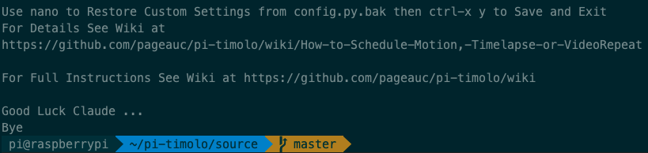

[This](https://github.com/chongzhizhao/pi-timolo) is a fork from the
[original repo](https://github.com/pageauc/pi-timolo).

The original project offers remote security monitoring with motion tracking,
auto syncing of files, auto twilight transition, and panoramic images.
I intend to apply this project to watching animals passing by my backyard.
Its functionality can be further extended to make certain decisions.

```sh
git clone git@github.com:chongzhizhao/pi-timolo.git
cd pi-timolo/sources
./pi-timolo-install.sh
```


